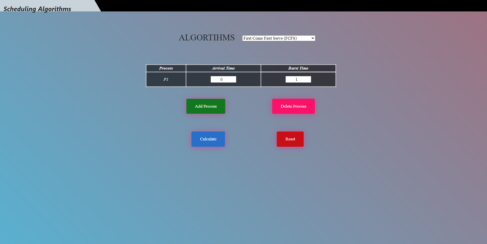
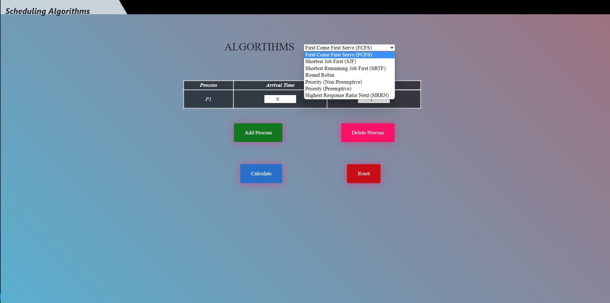
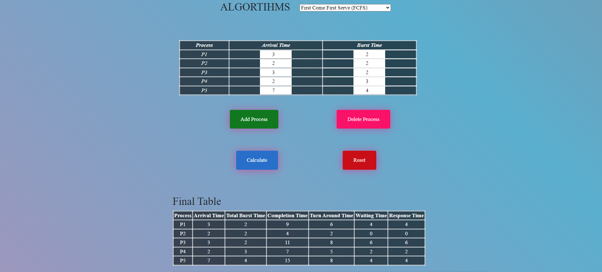
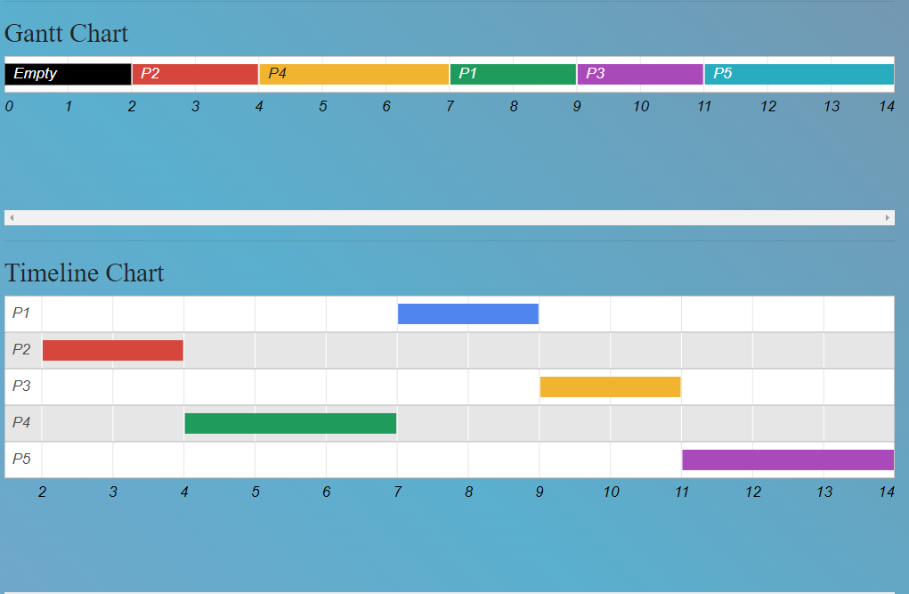
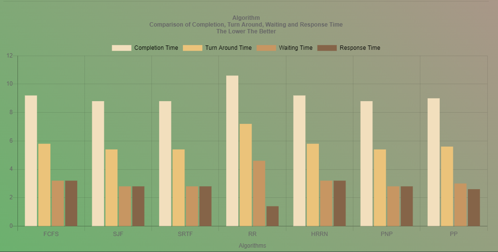

# CPU Scheduling application
This project is implemented in the extent of CENG4003 - Operating Systems as the term project.

## CPU Scheduling Algorithms

1. First Come First Serve - FCFS
2. Shortest Job First -SJF
3. Shortest Remaining Job First - SRTF
4. Priority (Non Preemptive) Based Scheduling
5. Priority (Preemptive) Based Scheduling
6. Round-Robin Scheduling
7. Highest Response Ratio Next - HRRN

Further details can be found in `Operating System Report` folder.

## Screenshots

    Main Page

    Algorithms

    Times Table

    Gantt Chart - Timeline Chart

    Times Graph

